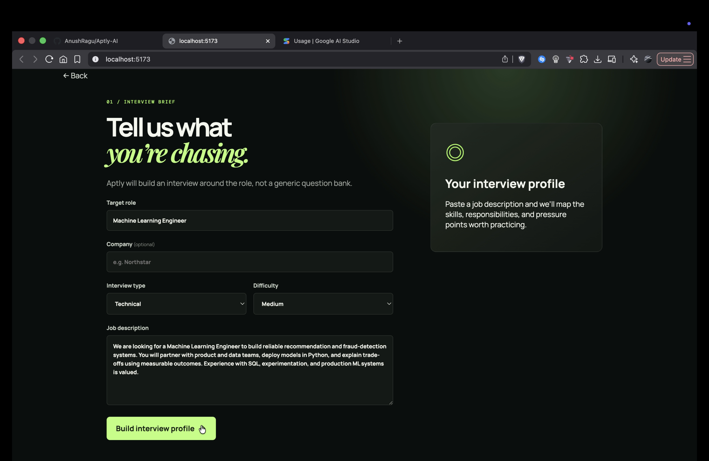
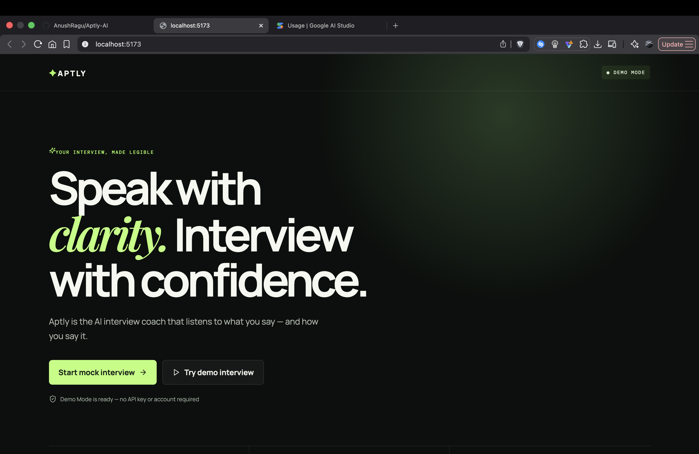
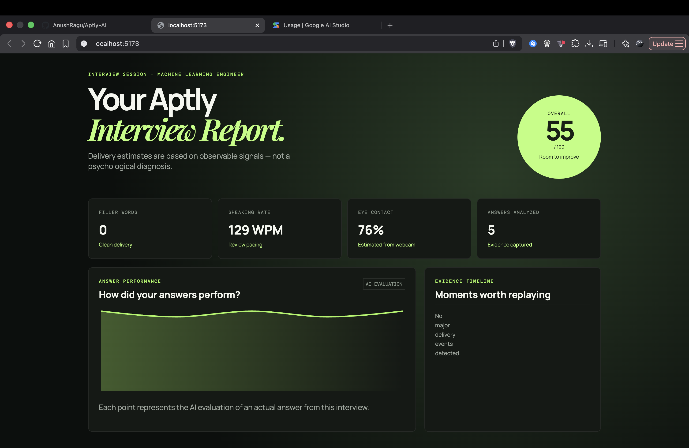

# Aptly AI

### AI Interview Coach That Watches, Listens & Corrects

> **Practice smarter. Speak better. Interview with confidence.**

Aptly AI is an AI-powered interview coach designed to help students and
job seekers improve both their **technical answers** and **interview
delivery**.

Instead of simply judging whether an answer is correct, Aptly analyzes
how you communicate --- including filler words, speaking pace, pauses,
eye contact, answer structure, technical depth, and relevance --- and
turns the interview into actionable feedback.

------------------------------------------------------------------------

## 🎯 Problem

Many students lose interview opportunities not because they lack
technical knowledge, but because they struggle to communicate that
knowledge effectively.

Common problems include:

-   Excessive filler words such as *um*, *uh*, *like*, and *basically*
-   Speaking too slowly or too quickly
-   Poor answer structure
-   Weak explanations of technical decisions
-   Lack of measurable results or evidence
-   Poor eye contact during virtual interviews
-   Difficulty knowing **what specifically went wrong**

Traditional mock interviews have another major problem:

> **Human interview coaching doesn't scale.**

Students need repeated practice and immediate, personalized feedback,
but professional interview coaching can be expensive and difficult to
access.

------------------------------------------------------------------------

## 💡 Our Solution

**Aptly AI** combines speech recognition, webcam delivery signals,
deterministic analysis, and LLM-powered evaluation into a single
interview practice platform.

``` text
Interview Question
       ↓
Candidate Answers
       ↓
┌─────────────────────────────┐
│       Aptly Analysis        │
├─────────────────────────────┤
│ Speech Recognition          │
│ Filler Detection            │
│ Speaking Rate               │
│ Pause Detection             │
│ Eye Contact                 │
│ Content Evaluation          │
│ Technical Depth             │
└─────────────────────────────┘
       ↓
Personalized Feedback
       ↓
Practice Drill
       ↓
Interview Report
```

------------------------------------------------------------------------

## ✨ Key Features

### 🎙️ Live Speech Transcription

Aptly uses browser-based speech recognition to provide fast
transcription while the candidate is speaking.

A backend transcription service is available as a fallback when
additional transcript processing is needed.

### 🧠 AI Answer Evaluation

Each answer is evaluated across:

-   **Relevance**
-   **Structure**
-   **Technical Depth**
-   **Overall Performance**

### 🗣️ Filler Word Detection

Aptly detects common filler words such as:

``` text
um
uh
like
basically
actually
literally
you know
I mean
kind of
sort of
```

Detected fillers are also surfaced in the interview evidence timeline.

### ⏱️ Speaking Rate Analysis

Aptly calculates words per minute (WPM) and classifies speaking pace.

``` text
< 100       → Slow
100–160     → Good pace
160–190     → Fast
> 190       → Very fast
```

### ⏸️ Pause Detection

Timestamped speech data is analyzed to identify unusually long pauses
and distinguish natural pauses from potentially disruptive ones.

### 👁️ Eye Contact Analysis

Aptly captures webcam-based eye-contact signals and displays an
estimated eye-contact score in the final report.

The camera preview can remain active throughout the interview while
microphone recording starts only when the candidate begins an answer.

### 📊 Interview Performance Report

After the interview, Aptly generates:

-   Overall score
-   Filler word count
-   Average speaking rate
-   Eye-contact estimate
-   Answers analyzed
-   Answer performance graph
-   Evidence timeline
-   Top 3 practice targets
-   Individual answer analysis

### 🔁 Non-Repetitive Feedback

Aptly provides **answer-specific feedback** rather than repeating the
same generic advice.

Feedback can focus on:

-   Weak ownership
-   Missing evidence
-   Weak technical depth
-   Poor structure
-   Low relevance
-   Missing measurable outcomes

------------------------------------------------------------------------

## 🖥️ Screenshots

### Interview Room


### Interview Report



### Answer-Level Feedback


------------------------------------------------------------------------

## 🏗️ System Architecture

``` text
                    ┌──────────────────────┐
                    │      React / Vite    │
                    │      Frontend        │
                    └──────────┬───────────┘
                               │
                 ┌─────────────┴─────────────┐
                 │                           │
                 ▼                           ▼
        Browser Speech API            Camera / Microphone
                 │                           │
                 │                           ▼
                 │                    Delivery Signals
                 │                           │
                 └─────────────┬─────────────┘
                               │
                               ▼
                    ┌──────────────────────┐
                    │       FastAPI        │
                    │       Backend        │
                    └──────────┬───────────┘
                               │
             ┌─────────────────┼─────────────────┐
             │                 │                 │
             ▼                 ▼                 ▼
       Transcription      Delivery Analysis   AI Evaluation
             │                 │                 │
             │          ┌──────┼──────┐          │
             │          │      │      │          │
             │        Fillers  WPM  Pauses        │
             │                 │                 │
             └─────────────────┼─────────────────┘
                               │
                               ▼
                    ┌──────────────────────┐
                    │   Interview Report   │
                    └──────────────────────┘
```

------------------------------------------------------------------------

## 🛠️ Tech Stack

### Frontend

-   React
-   TypeScript
-   Vite
-   Recharts
-   Lucide React
-   Web Speech API
-   MediaRecorder API
-   MediaDevices API

### Backend

-   Python
-   FastAPI
-   SQLAlchemy
-   Pydantic

### AI

-   Google Gemini API
-   Gemini-powered interview evaluation
-   Gemini transcription fallback

### Analysis

-   Python
-   Regular expressions
-   Timestamped speech analysis
-   Deterministic delivery metrics

------------------------------------------------------------------------

## 📁 Project Structure

``` text
Aptly-AI/
│
├── frontend/
│   ├── src/
│   │   ├── main.tsx
│   │   └── ...
│   ├── package.json
│   └── ...
│
├── backend/
│   ├── app/
│   │   ├── main.py
│   │   ├── analysis.py
│   │   └── ai/
│   │       ├── gemini_provider.py
│   │       └── transcription.py
│   │
│   ├── requirements.txt
│   └── ...
│
├── assets/
│   └── screenshots/
│       ├── interview-room.png
│       ├── interview-report.png
│       └── answer-feedback.png
│
└── README.md
```

------------------------------------------------------------------------

## 🚀 Getting Started

### Prerequisites

-   Node.js
-   npm
-   Python 3.9+
-   Git
-   Google Gemini API key

### Backend

``` bash
cd backend
python3 -m venv .venv
source .venv/bin/activate
pip install -r requirements.txt
```

Create `backend/.env`:

``` env
GEMINI_API_KEY=your_api_key_here
```

Start the backend:

``` bash
uvicorn app.main:app --reload
```

The API will run at:

``` text
http://localhost:8000
```

### Frontend

``` bash
cd frontend
npm install
npm run dev
```

Open the URL shown by Vite, usually:

``` text
http://localhost:5173
```

------------------------------------------------------------------------

## 🎤 How to Use Aptly

1.  **Create an interview** --- choose role, company, interview type,
    difficulty, and job description.
2.  **Enter the interview room** --- Aptly displays the question and
    camera preview.
3.  **Start answering** --- press **Start Answer** to activate the
    microphone and live speech recognition.
4.  **Answer naturally** --- Aptly analyzes speech, timing, filler
    words, pauses, pace, and webcam delivery signals.
5.  **Stop answering** --- press **Stop Answer**. The microphone stops
    while the camera preview remains available.
6.  **Review the report** --- see delivery metrics, evidence, practice
    targets, and answer-level feedback.

------------------------------------------------------------------------

## 🔐 Environment Variables

Never commit your API key.

``` env
GEMINI_API_KEY=your_api_key_here
```

Recommended `.gitignore` entries:

``` gitignore
.env
.venv/
node_modules/
__pycache__/
.DS_Store
```

------------------------------------------------------------------------

## 🧪 Current Limitations

Aptly is currently a hackathon-stage prototype.

-   Browser speech recognition depends on browser support.
-   Eye-contact measurement is an estimate, not a psychological
    assessment.
-   Gemini API quotas can limit AI requests.
-   Transcription quality can vary with microphone quality and browser
    conditions.
-   The interview generation and evaluation pipeline can be further
    refined.
-   The current experience is optimized for English-language interviews.

------------------------------------------------------------------------

## 🔮 Future Improvements

### Advanced Computer Vision

-   Face landmarks
-   Head-pose estimation
-   Gaze direction
-   Facial engagement signals

### Voice Delivery Analysis

-   Pitch variation
-   Monotone detection
-   Confidence estimation
-   Vocal energy
-   Speaking pauses

### Smarter Interview Adaptation

``` text
Candidate Answer
       ↓
AI identifies weakness
       ↓
Follow-up question
       ↓
Candidate clarifies
       ↓
Deeper evaluation
```

### Personalized Progress Tracking

``` text
Interview #1
    ↓
Interview #2
    ↓
Interview #3
    ↓
Performance Trends
```

### Interview-Specific Coaching

-   Software Engineering
-   Machine Learning
-   Data Science
-   Product Management
-   HR / Behavioral
-   System Design
-   Case Interviews

------------------------------------------------------------------------

## 🏆 Why Aptly?

Most interview preparation platforms focus primarily on **what you
know**.

Aptly focuses on:

> **What you know + how you communicate it.**

The goal isn't to replace human interviewers.

The goal is to make **high-quality interview practice available whenever
a candidate needs it.**

------------------------------------------------------------------------

## 👥 Team

-   **Anush R** --- AI / Machine Learning
-   **Arya A** --- Backend
-   **Ashwin V** --- Frontend
-   **Ashif Hussain M** --- Development / Integration

------------------------------------------------------------------------

## 📌 Project Status

**Hackathon Prototype --- Active Development**

Currently supported:

-   ✅ AI-generated interview questions
-   ✅ Live browser transcription
-   ✅ Gemini transcription fallback
-   ✅ Filler word detection
-   ✅ Speaking-rate analysis
-   ✅ Pause analysis
-   ✅ Eye-contact estimation
-   ✅ AI answer evaluation
-   ✅ Answer-specific feedback
-   ✅ Personalized practice drills
-   ✅ Interview performance reports

------------------------------------------------------------------------

```{=html}
<p align="center">
```
### Built with 🧠 AI, 🎙️ Speech, 👁️ Vision & 💻 Code

**Aptly AI --- Practice smarter. Interview better.**

```{=html}
</p>
```
## Screenshots

### Landing Page


### Interview Setup


### Interview Report
